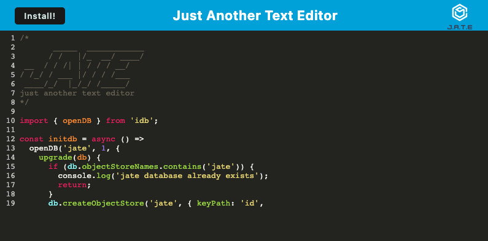

# PWA Text Editor

## Description

[Click here to visit the live app.](https://pwa-text-editor-101-37cb5cc1418a.herokuapp.com/)

A progressive web app that formats and colors JavaScript code.

## Usage

A user may do the following...

- Type JavaScript code into the editor

- Click the **"Install"** button to install the app on their computer.

## Credits

- Starter code by edX Boot Camps LLC